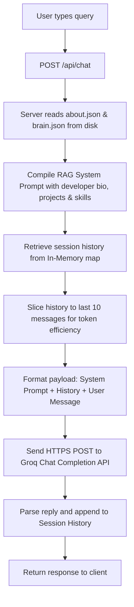

# RAM-AI Portfolio Chatbot & Project Grid 🧠⚡

A high-performance, full-stack RAG (Retrieval-Augmented Generation) AI Assistant and interactive portfolio grid built with **zero external npm dependencies** and powered by **Groq Llama-3.3-70b**. 

This repository serves as both a lightweight, standalone AI-powered portfolio site and a robust backend API for external frontends (such as your React/Vite Master portfolio) to query developer facts, skills, and projects in real-time.

---

## 🏗️ Architecture Overview

The application features a unique dual-architecture:
1. **Frontend**: An ultra-premium, dark obsidian glassmorphism landing page (`index.html`, `style.css`, `script.js`) with Web Audio API sound effects, dynamic category filtering, and chat interactions.
2. **Backend**: A pure Node.js HTTP server (`server.js`) that operates with zero npm dependencies, parses environment variables, serves static files, and drives a live RAG pipeline using the Groq API.

---

## 📂 Project Structure

Below is the directory structure for the `Project R` full-stack application:

```text
project R/
├── scratch/               # Scratch files and temporary workspace scripts
├── .env                  # Local environment configuration (API keys)
├── .env.example          # Sample environment variables template
├── .gitignore            # Git ignore configurations
├── .hintrc               # Project hinting and code quality settings
├── about.json            # Static developer bio, education, and credentials context
├── brain.json            # Project list, tech stack, and chatbot configuration context
├── index.html            # Main portfolio landing page with interactive chat interface
├── package.json          # Node.js project configuration (scripts)
├── ramunarlapati cv.pdf  # Professional resume document
├── README.md             # Codebase documentation and API reference
├── render.yaml           # Deployment configuration blueprint for Render hosting
├── script.js             # Client-side user interface interactions & chatbot logic
├── server.js             # Native Node.js backend HTTP server & RAG controller
├── start_server.bat      # Windows batch execution script to run local server
└── style.css             # Main stylesheet implementing dark glassmorphism styling
```

---

### 🧠 RAG & AI Pipeline Flow

The RAG assistant dynamically reads knowledge files from disk on every request. Here is how a user question is answered:



---

## ⚡ Key Highlights & Features

- **Zero NPM Dependencies**: Built using only Node.js native core libraries (`http`, `https`, `fs`, `path`, `url`). Zero package bloat, zero security audit warnings, and instant startup times.
- **Dynamic Context Reloading**: Reads `about.json` and `brain.json` on the fly for every incoming request. You can modify your projects or bio in the JSON files, and the AI assistant immediately learns the new facts without needing a server restart!
- **Session Memory Management**: Features an in-memory session store tracking separate client sessions. To optimize context window usage and prevent hallucination, it dynamically retains only the last 10 exchanges per session.
- **Cross-Origin Resource Sharing (CORS)**: Out-of-the-box preflight `OPTIONS` handling with full wildcard CORS support, enabling external portfolios to query its endpoints securely.
- **Lightweight Launcher**: Includes a quick-launcher script for Windows developers that automatically diagnoses Node.js, runs the server, and fires up the browser.

---

## 🔑 API Key Setup (Required)

The RAG chatbot requires a Groq API key to query the `llama-3.3-70b-versatile` model.

1. Locate or create a file named **`.env`** in the project root directory (you can copy `.env.example` to start).
2. Insert your Groq API key inside **`.env`**:
   ```env
   GROQ_API_KEY=your_actual_groq_api_key_here
   PORT=3000
   GROQ_MODEL=llama-3.3-70b-versatile
   ```
   *(Obtain a free API key at [console.groq.com/keys](https://console.groq.com/keys))*

---

## 🚀 How to Start the Application (Windows)

### Option 1: Double-Click Launcher (Easiest!)

Simply double-click the **`start_server.bat`** file inside this folder (`c:\website\project R`).

- This script will automatically verify Node.js is on your path, launch the backend server on port 3000, and open your default web browser to `http://localhost:3000`.

### Option 2: Terminal / Command Prompt

If you prefer running via command line:

1. Open your terminal or Command Prompt inside `c:\website\project R`.
2. Run the start command:
   ```bash
   node server.js
   ```
3. Open your browser and navigate to: **[http://localhost:3000](http://localhost:3000)**

---

## ⚠️ Why Did It Say "Not Running" Or Give CORS/Network Errors?

If you double-clicked `index.html` directly in your File Explorer, your web browser opened it using the **`file:///`** protocol (e.g., `file:///C:/website/project%20R/index.html`).

When opened this way:
1. **No backend server is running**, so the AI chatbot cannot communicate with the Groq API.
2. **Browser security (CORS)** blocks local JavaScript from reading the local `brain.json` and `about.json` files on disk.

👉 **Solution**: Always start the server using `start_server.bat` or `node server.js` and view the site through **[http://localhost:3000](http://localhost:3000)**.

---

## 🌐 API Reference

The backend exposes a clean REST API. You can interact with the live deployed instance (`https://project-r-cjgn.onrender.com`) or your local server (`http://localhost:3000`).

### 1. Health & Status Check
- **Endpoint**: `GET /api/health`
- **Description**: Returns system availability, active Groq LLM model, and knowledge base loading statistics.
- **Example Request**:
  ```bash
  curl https://project-r-cjgn.onrender.com/api/health
  ```
- **Response**:
  ```json
  {
    "status": "online",
    "model": "llama-3.3-70b-versatile",
    "knowledgeBase": { "projectsCount": 10, "hasAbout": true },
    "timestamp": "2026-07-08T23:30:00.000Z"
  }
  ```

### 2. RAG AI Chat Assistant
- **Endpoint**: `POST /api/chat`
- **Description**: Sends a user message to the Groq-powered RAG assistant. Retains session memory up to the last 10 messages.
- **Headers**: `Content-Type: application/json`
- **Request Body**:
  ```json
  {
    "message": "What projects has RAM built using React?",
    "sessionId": "user-session-123"
  }
  ```
- **Example Request**:
  ```bash
  curl -X POST https://project-r-cjgn.onrender.com/api/chat \
    -H "Content-Type: application/json" \
    -d '{"message": "Tell me about RAMs skills", "sessionId": "demo"}'
  ```
- **Response**:
  ```json
  {
    "reply": "RAM is a full-stack developer skilled in React, Node.js, and AI architecture...",
    "sessionId": "demo",
    "timestamp": "2026-07-08T23:30:05.000Z"
  }
  ```

### 3. Get Portfolio Projects
- **Endpoint**: `GET /api/projects`
- **Description**: Dynamically loads and returns all projects and metadata from `brain.json`.
- **Example Request**:
  ```bash
  curl https://project-r-cjgn.onrender.com/api/projects
  ```

### 4. Get Developer Profile
- **Endpoint**: `GET /api/about`
- **Description**: Returns developer bio, social links, and career summary from `about.json`.
- **Example Request**:
  ```bash
  curl https://project-r-cjgn.onrender.com/api/about
  ```

### 5. Reset Conversation Session
- **Endpoint**: `POST /api/reset`
- **Description**: Clears the in-memory chat history for a specific session ID.
- **Request Body**:
  ```json
  {
    "sessionId": "user-session-123"
  }
  ```
- **Response**:
  ```json
  {
    "status": "success",
    "message": "Session user-session-123 reset."
  }
  ```

---

Designed & Developed by **Narlapati Ramu** | 2026
